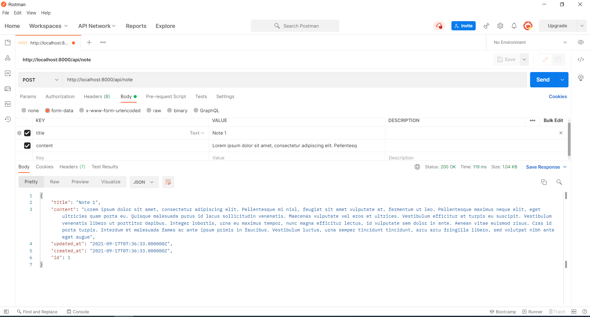
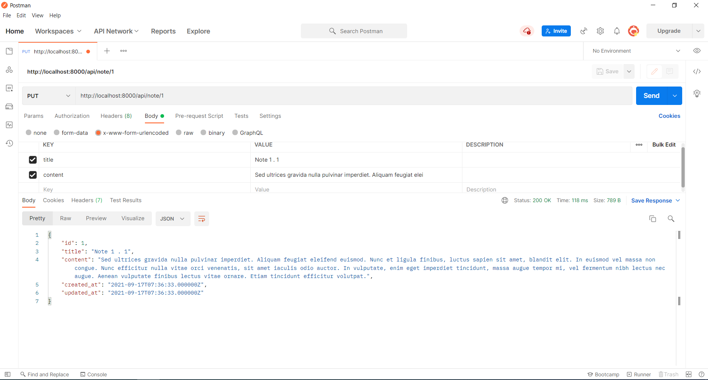
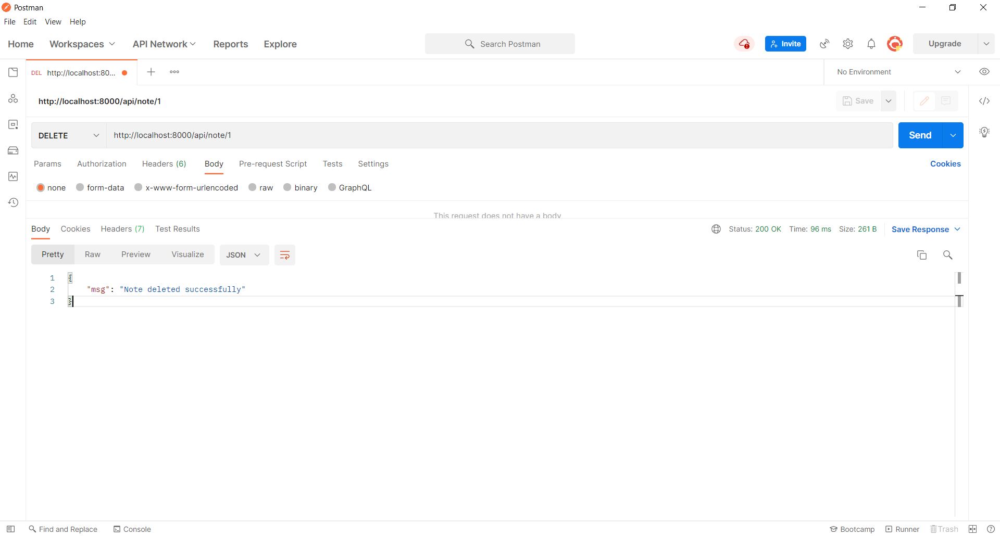

# Lumen PHP Framework


## Installation
````
composer create-project --prefer-dist laravel/lumen my-api
````

## Serving 

````
php -S localhost:8000 -t public
````

## Configuration

> .env

````
DB_CONNECTION=mysql
DB_HOST=127.0.0.1
DB_PORT=3306
DB_DATABASE=demo
DB_USERNAME=root
DB_PASSWORD=

CACHE_DRIVER=array
QUEUE_CONNECTION=database
````

> /bootstrap/app.php

````php
<?php
/*
|--------------------------------------------------------------------------
| Create The Application
|--------------------------------------------------------------------------
|
| Here we will load the environment and create the application instance
| that serves as the central piece of this framework. We'll use this
| application as an "IoC" container and router for this framework.
|
*/

$app = new Laravel\Lumen\Application(
    dirname(__DIR__)
);

$app->withFacades();

$app->withEloquent();
````

## Create model

> /app/Models/Note.php

````php
<?php
namespace App\Models;

use Illuminate\Database\Eloquent\Factories\HasFactory;
use Illuminate\Database\Eloquent\Model;

class Note extends Model
{
    use  HasFactory;

    protected $fillable = [
        'title', 'content',
    ];
}

````
## Create migration 

````
php artisan make:migration create_notes_table
````

> database/migrations/2021_09_16_050121_create_notes_table.php

````php
<?php

use Illuminate\Database\Migrations\Migration;
use Illuminate\Database\Schema\Blueprint;
use Illuminate\Support\Facades\Schema;

class CreateNotesTable extends Migration
{
    /**
     * Run the migrations.
     *
     * @return void
     */
    public function up()
    {
        Schema::create('notes', function (Blueprint $table) {
            $table->id();
            $table->string('title');
            $table->text('content');
            $table->timestamps();
        });
    }

    /**
     * Reverse the migrations.
     *
     * @return void
     */
    public function down()
    {
        Schema::dropIfExists('notes');
    }
}
````

````
php artisan migrate
````

## Create controller

> app/Http/Controllers/NoteController.php

````php
<?php

namespace App\Http\Controllers;

use App\Models\Note;
use Illuminate\Http\Request;


class NoteController extends Controller
{
    public function __construct()
    {
    }

    public function index()
    {
        $notes = Note::all();
        return response()->json($notes);
    }

    public function create(Request $request)
    {
        $note = Note::create($request->all());
        return response($note);
    }

    public function show($id)
    {
        $note = Note::find($id);
        return response()->json($note);
    }

    public function update(Request $request, $id)
    {
        $note = Note::find($id);
        $note->title = $request->input('title');
        $note->content = $request->input('content');
        return response()->json($note);
    }

    public function destroy($id)
    {
        $note = Note::find($id);
        $note->delete();
        return response()->json(['msg' => 'successfully deleted']);       
    }
}
````

## create routes

> /routes/web.php
````php
<?php

$router->group(['prefix'=>'api'],function () use($router){
    $router->get('/notes', 'noteController@index') ;
    $router->get('/note/{id}', 'noteController@show');
    $router->post('/note', 'noteController@create');
    $router->put('/note/{id}', 'noteController@update');
    $router->delete('/note/{id}', 'noteController@destroy');
});
````

## Testing

### Create note : POST  



### Update note : PUT 



### Show note : GET 


### Delete note : DELETE 




